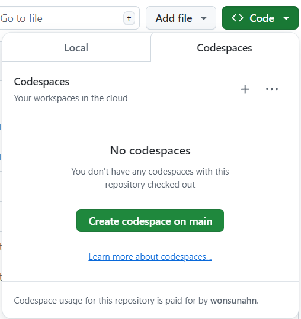
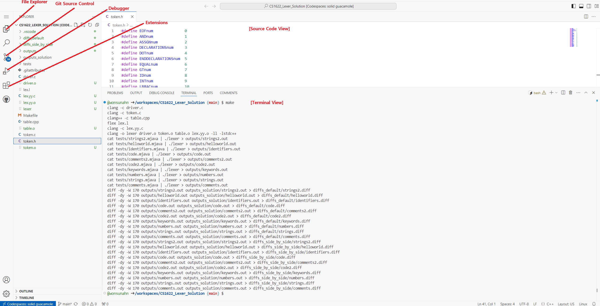
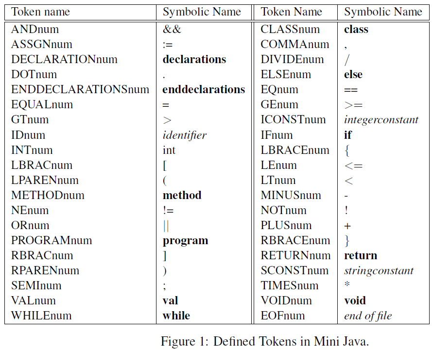

- [Project 1: Lexical Analysis](#project-1--lexical-analysis)
  * [Description](#description)
  * [Codespace Development Environment](#codespace-development-environment)
  * [Directory Structure and Makefile Script](#directory-structure-and-makefile-script)
  * [Implementation](#implementation)
    + [Token Definitions in MINI-JAVA](#token-definitions-in-mini-java)
    + [Completing lex.l](#completing-lexl)
    + [Completing table.cpp](#completing-tablecpp)
    + [Debugging](#debugging)
  * [Grading](#grading)
  * [Submission](#submission)

# Project 1: Lexical Analysis

DUE: September 24 (Tuesday), 2024 Before Class

Please accept Project 1 on **GitHub Classroom** using the following link: https://classroom.github.com/a/TZB8y3GP

When you accept the assignment, a new GitHub repository will be automatically
created for you with which you will do backup, versioning, and submission.

## Description

In this phase of the project, you will write a lexical analyzer for the CS 1622
programming language, MINI-JAVA. The analyzer will consist of a scanner,
written in LEX, and routines to manage a string table, written in C/C++. The
next phase of the compiler project, syntax analysis, will use tokens generated
by lexical analysis to construct the syntax tree.

Please follow the below instructions.

## Codespace Development Environment

Open the GitHub Classroom repository that was created for you in your browser.
Then, press the green "Code" button and then the "Create codespace on main"
button on the "Codespaces" tab as shown below.



This will fire up a new codespace container on the GitHub cloud.  The container
runs the latest verions of the Ubuntu Linux operating system and provides a
virtualized VSCode development environment.  The window should look something
like the below:



For those of you who are new to VSCode, I have labeled important components of
VSCode in red text.  Please enlarge the above image by clicking on it if you
have trouble reading the text.  For an enhanced C/C++ coding experience, please
install the C++ Extension Pack by clicking on the Extensions menu on the left,
and then searching for "C/C++" in the search box.  This is the link to the
extension I'm referring to:

https://marketplace.visualstudio.com/items?itemName=ms-vscode.cpptools-extension-pack

Next, in order to be able to compile and run your lexical analyzer, you need to
install the Flex lexical analysis tool by inputting these two commands on the
terminal:

```
sudo apt-get update
sudo apt-get install flex
```

Once you install flex, you should be able to build the lexer binary by invoking
the build target of the Makefile script on the terminal:

```
make build
```

This should result in the following output:

```
$ make build
gcc -g -c driver.c
gcc -g -c token.c
g++ -g -c table.cpp
flex lex.l
gcc -g -c lex.yy.c 
gcc -g -o lexer driver.o token.o table.o lex.yy.o -ll -lstdc++
```

After creating the lexer binary, you are able to use the Debugger menu to step
through the code, put breakpoints, or watch variables.  I will explain more of
this in the [Debugging] section.

**WARNING**: The important thing to remember is that each Codespace instance is
a container on the cloud.  So all the file modifications you do will be done on
the container instance and not on the github repository files.  If you want
your changes to get reflected on your repository, you have to commit and push
your changes, just like on any machine.  You can use the Git Source Control
menu to do that:

https://docs.github.com/en/codespaces/developing-in-a-codespace/using-source-control-in-your-codespace#committing-your-changes

Your Codespace will only get deleted if you manually delete it, unless you
leave a Codespace idle for 30 days.  A week before the 30 daya, GitHub will
warn you that the Codespace will be garbage collected, and if you don't take
any action, it will delete the container.  I can't think of a scenario where
this would happen for our projects unless you completely forget to push your
changes after you are all done but beware.  

## Directory Structure and Makefile Script

Here is an overview of the directory structure in alphabetical order.  The files that you are expected to modify are marked in bold:

* driver.c : The test driver for the lexer that contains the main function.
* **lex.l** : Implements the lexer using the Lex language.  **Modify**.
* Makefile: The build script for the make tool.
* **table.cpp** : Implements the string table.  **Modify**.
* token.h / token.c : #define macros for token types and the getTokenString function.
* diffs_default/ : Directory where comparisons between outputs/ and outputs_solution/ are stored, generated by the <tt>diff</tt> command.
* diffs_side_by_side/ : Directory where side-by-side comparisons between outputs/ and outputs_solution/ are stored, generated by the <tt>diff</tt> command with the <tt>-y</tt> option added.
* outputs/ : Directory where outputs after running lexer on source files under tests/ are stored.
* outputs_solution/ : Directory where solution outputs after running lexer on source files under tests/ are stored.
* tests/ : Source files for testing and grading your lexer.

As mentioned above, in order to just build the lexer binary, you only need to invoke the build make target:

```
make build
```

To run the lexer against the source files under tests/ after building, invoke the default make target:

```
make
```

The output should look like:

```
g++ -g -c table.cpp
flex lex.l
gcc -g -c lex.yy.c 
gcc -g -o lexer driver.o token.o table.o lex.yy.o -ll -lstdc++
cat tests/code2.mjava | ./lexer > outputs/code2.out
cat tests/strings2.mjava | ./lexer > outputs/strings2.out
cat tests/helloworld.mjava | ./lexer > outputs/helloworld.out
cat tests/identifiers.mjava | ./lexer > outputs/identifiers.out
cat tests/code.mjava | ./lexer > outputs/code.out
cat tests/comments2.mjava | ./lexer > outputs/comments2.out
cat tests/keywords.mjava | ./lexer > outputs/keywords.out
cat tests/numbers.mjava | ./lexer > outputs/numbers.out
cat tests/strings.mjava | ./lexer > outputs/strings.out
cat tests/comments.mjava | ./lexer > outputs/comments.out
diff -dy -W 170 outputs/code2.out outputs_solution/code2.out > diffs_default/code2.diff
make: [Makefile:44: diffs_default/code2.diff] Error 1 (ignored)
diff -dy -W 170 outputs/strings2.out outputs_solution/strings2.out > diffs_default/strings2.diff
make: [Makefile:44: diffs_default/strings2.diff] Error 1 (ignored)
diff -dy -W 170 outputs/helloworld.out outputs_solution/helloworld.out > diffs_default/helloworld.diff
make: [Makefile:44: diffs_default/helloworld.diff] Error 1 (ignored)
diff -dy -W 170 outputs/identifiers.out outputs_solution/identifiers.out > diffs_default/identifiers.diff
make: [Makefile:44: diffs_default/identifiers.diff] Error 1 (ignored)
diff -dy -W 170 outputs/code.out outputs_solution/code.out > diffs_default/code.diff
make: [Makefile:44: diffs_default/code.diff] Error 1 (ignored)
diff -dy -W 170 outputs/comments2.out outputs_solution/comments2.out > diffs_default/comments2.diff
make: [Makefile:44: diffs_default/comments2.diff] Error 1 (ignored)
diff -dy -W 170 outputs/keywords.out outputs_solution/keywords.out > diffs_default/keywords.diff
make: [Makefile:44: diffs_default/keywords.diff] Error 1 (ignored)
diff -dy -W 170 outputs/numbers.out outputs_solution/numbers.out > diffs_default/numbers.diff
make: [Makefile:44: diffs_default/numbers.diff] Error 1 (ignored)
diff -dy -W 170 outputs/strings.out outputs_solution/strings.out > diffs_default/strings.diff
make: [Makefile:44: diffs_default/strings.diff] Error 1 (ignored)
diff -dy -W 170 outputs/comments.out outputs_solution/comments.out > diffs_default/comments.diff
make: [Makefile:44: diffs_default/comments.diff] Error 1 (ignored)
diff -dy -W 170 outputs/code2.out outputs_solution/code2.out > diffs_side_by_side/code2.diff
make: [Makefile:44: diffs_side_by_side/code2.diff] Error 1 (ignored)
diff -dy -W 170 outputs/strings2.out outputs_solution/strings2.out > diffs_side_by_side/strings2.diff
make: [Makefile:44: diffs_side_by_side/strings2.diff] Error 1 (ignored)
diff -dy -W 170 outputs/helloworld.out outputs_solution/helloworld.out > diffs_side_by_side/helloworld.diff
make: [Makefile:44: diffs_side_by_side/helloworld.diff] Error 1 (ignored)
diff -dy -W 170 outputs/identifiers.out outputs_solution/identifiers.out > diffs_side_by_side/identifiers.diff
make: [Makefile:44: diffs_side_by_side/identifiers.diff] Error 1 (ignored)
diff -dy -W 170 outputs/code.out outputs_solution/code.out > diffs_side_by_side/code.diff
make: [Makefile:44: diffs_side_by_side/code.diff] Error 1 (ignored)
diff -dy -W 170 outputs/comments2.out outputs_solution/comments2.out > diffs_side_by_side/comments2.diff
make: [Makefile:44: diffs_side_by_side/comments2.diff] Error 1 (ignored)
diff -dy -W 170 outputs/keywords.out outputs_solution/keywords.out > diffs_side_by_side/keywords.diff
make: [Makefile:44: diffs_side_by_side/keywords.diff] Error 1 (ignored)
diff -dy -W 170 outputs/numbers.out outputs_solution/numbers.out > diffs_side_by_side/numbers.diff
make: [Makefile:44: diffs_side_by_side/numbers.diff] Error 1 (ignored)
diff -dy -W 170 outputs/strings.out outputs_solution/strings.out > diffs_side_by_side/strings.diff
make: [Makefile:44: diffs_side_by_side/strings.diff] Error 1 (ignored)
diff -dy -W 170 outputs/comments.out outputs_solution/comments.out > diffs_side_by_side/comments.diff
make: [Makefile:44: diffs_side_by_side/comments.diff] Error 1 (ignored)
```

You can see each of the source files under tests/ being piped into the lexer
binary as stdin.  The results of the lexing are stored unrder the corresponding
.out files under the outputs/ folder.  You can also see that each of the diff
commands comparing .out files under the outputs/ folder and outputs_solution/
folder are failing.  That is because as of now, your lexer is incomplete.

Try viewing one of the diff files by issuing the following command:

```
cat diffs_default/helloworld.diff
```

The result is:

```
$ cat diffs_default/helloworld.diff 
2,9c2,23
< /* Example 1: A hello world program */
< program xyz;
< class Test {
<     method void main() {
<         System.println('Hello World !!!');
<     }
< }
< 1     1       EOFnum          
---
> 2     8       PROGRAMnum      
> 2     12      IDnum                   0
> 2     13      SEMInum         
> 3     6       CLASSnum        
> 3     11      IDnum                   4
> 3     13      LBRACEnum       
> 4     11      METHODnum       
> 4     16      VOIDnum         
> 4     21      IDnum                   9
> 4     22      LPARENnum       
> 4     23      RPARENnum       
> 4     25      LBRACEnum       
> 5     15      IDnum                   14
> 5     16      DOTnum          
> 5     23      IDnum                   21
> 5     24      LPARENnum       
> 5     41      SCONSTnum               29
> 5     42      RPARENnum       
> 5     43      SEMInum         
> 6     6       RBRACEnum       
> 7     2       RBRACEnum       
> 8     1       EOFnum          
11c25
< String Table : 
---
> String Table : xyz Test main System println Hello World !!!
```

I will take you through the interpretation of this diff file, as many of you
may be unfamiliar with the tool.  The first line <tt>2,9c2,23</tt> is saying there
is a difference between lines 2-9 on the first file (outputs/helloworld.out)
and 2-23 on the second file (outputs_solution/helloworld.out).  The next series
of lines show the difference with lines starting with <tt>\<</tt> denoting lines on
the first (left) file and lines starting with <tt>\></tt> denoting lines on the right
file.  There is a divider <tt>---</tt> in between.  The following line <tt>11c25</tt>
shows the next set of differences between line 11 on the left file and line 25
on the right file.

If this is hard to view and you want a side-by-side comparison, you can do:

```
cat diffs_side_by_side/helloworld.diff
```

The result is:

```
$ cat diffs_side_by_side/helloworld.diff 
Line    Column  Token                   Lexeme                  Line    Column  Token                   Lexeme
/* Example 1: A hello world program */                     |    2       8       PROGRAMnum      
program xyz;                                               |    2       12      IDnum                   0
class Test {                                               |    2       13      SEMInum         
    method void main() {                                   |    3       6       CLASSnum        
        System.println('Hello World !!!');                 |    3       11      IDnum                   4
    }                                                      |    3       13      LBRACEnum       
}                                                          |    4       11      METHODnum       
1       1       EOFnum                                     |    4       16      VOIDnum         
                                                           >    4       21      IDnum                   9
                                                           >    4       22      LPARENnum       
                                                           >    4       23      RPARENnum       
                                                           >    4       25      LBRACEnum       
                                                           >    5       15      IDnum                   14
                                                           >    5       16      DOTnum          
                                                           >    5       23      IDnum                   21
                                                           >    5       24      LPARENnum       
                                                           >    5       41      SCONSTnum               29
                                                           >    5       42      RPARENnum       
                                                           >    5       43      SEMInum         
                                                           >    6       6       RBRACEnum       
                                                           >    7       2       RBRACEnum       
                                                           >    8       1       EOFnum          

String Table :                                             |    String Table : xyz Test main System println Hello World 
```

The left hand side shows the first file and the right hand side shows the
second file.  There is sort of a divider between the two sides composed of
<tt>|</tt> and <tt>\></tt> characters.  The <tt>|</tt> character denotes lines that differ
between the two sides.  The <tt>\></tt> character denotes lines that are only on the
right hand side, and not on the left hand side.  And the <tt>\<</tt> character (not
shown here) denotes the opposite.  If there is no character in the divider,
that means both sides are identical.  In this case, there is only one line that
is identical --- the empty line at the second to the last line.

If you wish to remove all files generated from the make build script and start
from scratch, invoke the 'clean' target:

```
make clean
```

## Implementation

Your goal is to modify lex.l and table.cpp so that your outputs are identical
to the solution outputs.  If you achieve that, the make build script will show
no errors when invoked, and all the .diff files under diffs_default/ will be
empty when listed:

```
$ ls -l diffs_default/
total 0
-rw-rw-rw- 1 codespace codespace 0 Sep  3 00:45 code.diff
-rw-rw-rw- 1 codespace codespace 0 Sep  3 00:45 code2.diff
-rw-rw-rw- 1 codespace codespace 0 Sep  3 00:45 comments.diff
-rw-rw-rw- 1 codespace codespace 0 Sep  3 00:45 comments2.diff
-rw-rw-rw- 1 codespace codespace 0 Sep  3 00:45 helloworld.diff
-rw-rw-rw- 1 codespace codespace 0 Sep  3 00:45 identifiers.diff
-rw-rw-rw- 1 codespace codespace 0 Sep  3 00:45 keywords.diff
-rw-rw-rw- 1 codespace codespace 0 Sep  3 00:45 numbers.diff
-rw-rw-rw- 1 codespace codespace 0 Sep  3 00:45 strings.diff
-rw-rw-rw- 1 codespace codespace 0 Sep  3 00:45 strings2.diff
```

You will achieve this by replacing the TODO comments in the source files as
instructed in the comments.

### Token Definitions in MINI-JAVA

First, let's start by talking about the tokens defined in the MINI-JAVA
language we are going to compile.  The token types defined in the language is
given in Figure 1 below.



The token types are defined in the file [token.h](token.h).  The Symbol Name
column corresponds to the strings that match the given token type.  The strings
in bold are keywords.  The strings in italics indicate a pattern that is given
by the following:

* _identifier_: An alphabet character followed by zero or more alpha-numeric characters.

* _integerconstant_: A sequence of one or more digits between 0-9.

* _stringconstant_: A string of characters between two quote (') characters.  The string can contain any characters with the exception of ' (quote) and \n (newline) characters for obvious reasons.  The string supports escape characters, namely: \\', \n, \t, \\\\ which is a sequence of two characters starting with the backslash (\\) character.  These escape characters should translate to the single characters quote, newline, tab, and backslash when stored in the string table (see below in the [Completing table.cpp](#completing-tablecpp) section).

### Completing lex.l

Please review the slides and the [Lexer Sample
Code](https://github.com/wonsunahn/CS1622_Fall2024/tree/main/sample_code/lexer)
before getting started.  There is also a [Lex
Manual](https://github.com/wonsunahn/CS1622_Fall2024/blob/main/resources/lex.pdf)
for reference.

Your main job would be to add token declarations and actions for each token as
explained in the TODO comments.  Please remember these two rules about Lex: 1)
If there is a choice between multiple possible tokens, Lex always chooses the
longest token, and 2) if there is a tie in terms of length between multiple
tokens, Lex chooses the token that appears first in the rules section of lex.l.
So you should list tokens in the order of precedence in the rules section.

As we learned in class, comments should be ignored by the lexer as they do not
serve any purpose in code generation.  In order to do this, once the start of a
comment is detected (the <tt>/\*</tt> string), you should scan and ignore all
characters until you encounter a <tt>\*/</tt> string that ends the comment.  You
might find the following Lex function handy:

```
char input();
```

The semantics of this function as explained in the Lax Manual is to scan in a
single character from the input stream and return that character.  If EOF
(End-Of-File) is reached, the function returns 0.  You can use this function to
scan in characters one by one until the <tt>\*/</tt> sequence is reached.

Please remember to return the appropriate token type declared in token.h for
each token action as was done in the Lexer Sample Code.  The token type is
returned in the <tt>yylex()</tt> function used to retrieve the next token during
syntax analysis, the next phase of the compiler, or in the test driver main
function as pertains to this project.

But we learned that a token is a tuple of (type, lexeme), so where is the
lexeme stored?  We define a variable yylval of int type in lex.l to store the
lexeme.  It is your job to store the appropriate lexeme in yylval for all
relevant token types: ICONSTnum, SCONSTnum, and IDnum.  They are integer
constants, string constants, and identifiers respectively.  For these token
types, it is important to store the values of the constants or the names of the
identifiers as lexemes for later code generation.

Lastly, you are asked to maintain the yyline and yycolumn variables defined in
lex.l which denote that current line and column number in the source file that
is getting scanned.  They are needed when reporting errors in the
<tt>reportError</tt> function.  The <tt>yyleng</tt> variable that stores the token length
will prove instrumental in calculating how much to advance the column number.
Also, you will be able to tell when it is time to increment the line number
when a newline character is encountered.

### Completing table.cpp

Now you might ask, how can the lexeme for string constants or identifier names
be stored in an int type variable yylval?  The simple answer is that it is
entirely appropriate that these lexemes be stored as numbers.  How so?

Within a executable binary file, along with the code section where machine
instructions are stored is a read-only data section called the string table.
The string table contains all the string constants used in the program, as well
as identifier names if debug symbols are enabled (well, in a real compiler,
usually identifier names are stored in a separate table called the symbol table
but we will include it into the string table in our simple compiler).  The
string table is literally a concatenation of all the strings used in the
program separated by the null-terminator.  When the executable binary is loaded
into memory, this string table is loaded into memory along with the code.

In the final generated machine code, whenever there is a reference to a string
constant or identifier, it is going to translate to an address that points to a
location in this string table where the string is stored.  This address can be
calculated as <tt>\<string table base address\> + \<offset within string table\></tt>.
Therefore, it is appropriate that we maintain the <tt>\<offset within string table\></tt>
as the lexeme for a string constant or identifier.  There should be
only one instance of a string in the string table for memory efficiency
purposes.

The source file table.cpp contains a function <tt>void addStringTable(char \*text, int tokenType)</tt>
that you are asked to complete.  It adds <tt>text</tt> of the given
<tt>tokenType</tt> to the string table if the string does not already exist.  It
also stores the index into the string table of that text into yylval, that
represents the lexeme.  The file predeclares a <tt>hashTable</tt> variable of
<tt>std::unordered_map\<std::string, int\></tt> type to help with the implementation.
If you are unfamiliar with C++ data structures, here are the documentations for
[std::unordered_map](https://en.cppreference.com/w/cpp/container/unordered_map)
and [std::string](https://cplusplus.com/reference/string/string/) respectively.
Note that the file has the .cpp extension (for C++ code) and not the .c
extension (for C code) exactly because I wanted to give you access to this C++
data structures.  No need to reinvent hash tables from scratch as this is not a
data structres class.

### Debugging

You can click on the Debugger menu on the VSCode IDE to get to the RUN AND
DEBUG pane.  There you will see a play icon next to a drop box with <tt>Launch lexer</tt>
selected.  You can click on that play icon to start debugging.  The
<tt>Launch lexer</tt> selection is a launch configuration defined in the
[.vscode/launch.json](.vscode/launch.json) file.  In that file, you will see
that the <tt>args</tt> property is set with an input redirection to
<tt>${workspaceFolder}/tests/helloworld.mjava</tt>.  If you wish to debug with some
other input file, please change helloworld.mjava to some other .mjava file
under the tests/ folder.

If you are not familiar with VSCode debugging, here is a tutorial:
https://code.visualstudio.com/docs/editor/debugging

Note that you are not allowed to put breakpoints on lex.l, because it is not a
C/C++ source file.  However, you can put breakpoints on lex.yy.c that is
generated from lex.l.

## Grading

Each of the 10 tests under the tests/ folder is worth 10 points for a total of
100 points.  A diff failure on the output for one of these .mjava files will
result in a deduction of 10 points.

## Submission

When all tests pass, you are ready to submit.  Please submit your GitHub
Classroom repository to GradeScope at the "Project 1" link.  Once you submit,
GradeScope will run the autograder to grade you and give feedback.  If you get
deductions, fix your code based on the feedback and resubmit.  Repeat until you
don't get deductions.  The tests performed on GradeScope is identical to the
tests under the tests/ folder.

Don't forget that you have to Commit and Push your changes to upload them to
the repository.  Please review this tutorial if you don't remember how:

https://docs.github.com/en/codespaces/developing-in-a-codespace/using-source-control-in-your-codespace#committing-your-changes

IMPORTANT: Please keep the github private!  This applies to all future submissions.
