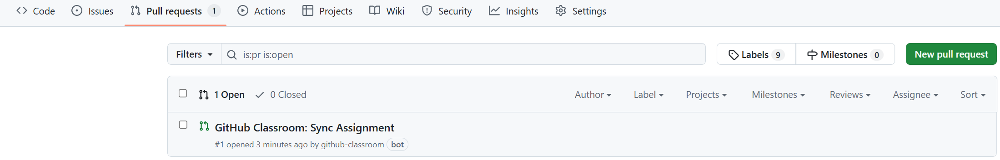
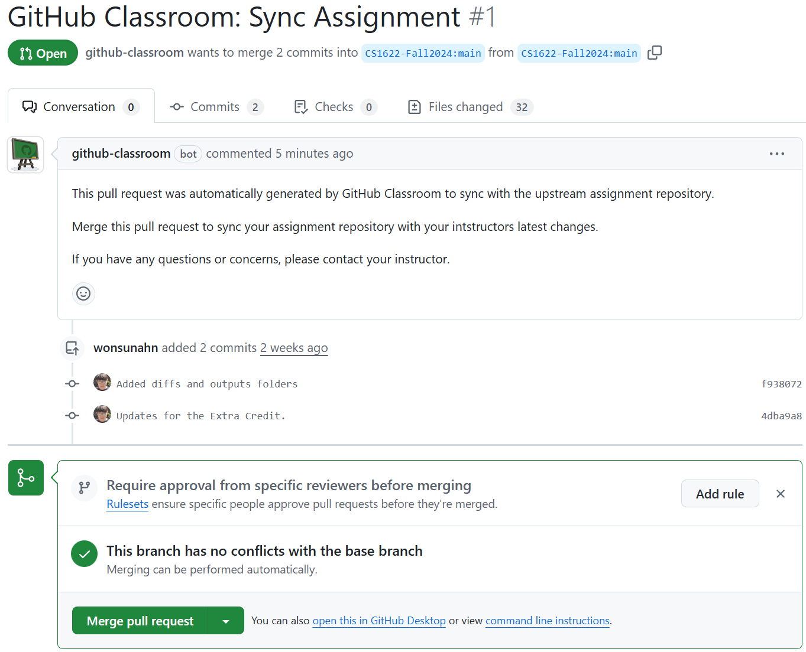

- [Project 3: Semantic Analysis](#project-3--semantic-analysis)
  * [Description](#description)
  * [Codespace Development Environment](#codespace-development-environment)
  * [Directory Structure and Makefile Script](#directory-structure-and-makefile-script)
  * [Implementation](#implementation)
    + [Updating lex.l, grammar.y, and table.cpp](#updating-lexl-grammary-and-tablecpp)
    + [Completing proj3.cpp and table.cpp](#completing-proj3cpp-and-tablecpp)
    + [Completing semantic.cpp](#completing-semanticcpp)
  * [Appendix](#appendix)
    + [Appendix A: Attributes in the symbol table](#appendix-a-attributes-in-the-symbol-table)
    + [Appendix B: Doxygen documentation generation](#appendix-b-doxygen-documentation-generation)
    + [Appendix C: Debugging](#appendix-c-debugging)
    + [Appendix D: Extra Credit](#appendix-d-extra-credit)
    + [Appendix E: Obtaining the solution for Project 2](#appendix-e-obtaining-the-solution-for-project-2)
  * [Grading](#grading)
  * [Submission](#submission)

# Project 3: Semantic Analysis

DUE: November 26 (Tuesday), 2024 1:00 PM

Please accept Project 3 on **GitHub Classroom** using the following link: https://classroom.github.com/a/vIXXs62k

## Description

In this phase of the project, you will write a semantic analyzer for the CS
1622 programming language, MINI-JAVA. The analyzer will analyze the syntax tree
generated from the parser in the previous stage to first populate a symbol
table on declarations of symbols, and second use the symbol table to perform
semantic analysis tasks on the symbol uses.  

## Codespace Development Environment

Please refer to the Project 1 CodeSpace Development Environment section to set
up the same development environment.  Just like before, please install Flex/Bison:

```
sudo apt-get update
sudo apt-get install -y flex
```

And the VSCode C++ Extensions Pack:

https://marketplace.visualstudio.com/items?itemName=ms-vscode.cpptools-extension-pack

In addition to that, we need to set up the Clang/LLVM development environment
as we are going to start leveraging Clang/LLVM to build our compiler.  First, let's start by installing the Clang/LLVM build tools:

```
sudo apt-get install -y clang-10 lldb-10 lld-10 clangd-10 clang-tidy-10 clang-format-10 clang-tools-10 llvm-10-dev llvm-10-tools libomp-10-dev libc++-10-dev libc++abi-10-dev libclang-common-10-dev libclang-10-dev libclang-cpp10-dev
```

Then, let's install the VSCode CodeLLDB extension to enable VSCode debugging using LLDB (which is the GDB counterpart for Clang/LLVM):

https://marketplace.visualstudio.com/items?itemName=vadimcn.vscode-lldb

Now we are all set!  You should be able to build the parser binary by invoking
the build target of the Makefile script on the terminal:

```
make build
```

This results in the following output:

```
$ make build
flex lex.l
yacc -d -v grammar.y
clang++-10 -stdlib=libc++ -g -I . `llvm-config-10 --cxxflags` -c table.cpp -o table.o
clang++-10 -stdlib=libc++ -g -I . `llvm-config-10 --cxxflags` -c proj2.cpp -o proj2.o
clang++-10 -stdlib=libc++ -g -I . `llvm-config-10 --cxxflags` -c proj3.cpp -o proj3.o
clang++-10 -stdlib=libc++ -g -I . `llvm-config-10 --cxxflags` -c main.cpp -o main.o
clang++-10 -stdlib=libc++ -g -I . `llvm-config-10 --cxxflags` -c semantic.cpp -o semantic.o
clang++-10 -stdlib=libc++ -g -I . `llvm-config-10 --cxxflags` -c llvm/LLVMGlobals.cpp -o llvm/LLVMGlobals.o
clang-10 -g -I . `llvm-config-10 --cflags` -c y.tab.c -o y.tab.o
clang++-10 -stdlib=libc++ -g -I . `llvm-config-10 --cxxflags --ldflags --system-libs --libs all` -o parser ./table.o ./proj2.o ./proj3.o ./main.o ./semantic.o ./llvm/LLVMGlobals.o y.tab.o -lfl
```

We are using Clang version 10. Clang++ is the Clang C++ compiler and clang is the C compiler.

After creating the parser binary, you are able to use the VSCode Debugger to step
through the code, put breakpoints, just like for Projects 1 and 2.  Refer to the
[Debugging] section for more details.

## Directory Structure and Makefile Script

Here is an overview of the directory structure in alphabetical order.  The files that you are expected to modify are marked in bold:

* **grammar.y** : Implements the parser using the Yacc language. **Modify**.
* **lex.l** : Implements the lexer using the Lex language.  **Modify**.
* main.cpp : The main function for the compiler.  Processes various command line arguments.
* Makefile : The build script for the make tool.
* proj2.cpp / proj2.h : Helper functions for building the parse tree, pre-implemented for you.
* **proj3.cpp** / proj3.h : Helper functions for building and querying the symbol table, (mostly) pre-implemented for you.  **Modify**
* **semantic.cpp** : Implements the semantic analysis stage of the compiler.  **Modify**.
* **table.cpp** : Implements the string table.  **Modify**.
* diffs/ : Directory where comparisons between outputs/ and outputs_solution/ are stored, generated by the <tt>diff</tt> command.
* outputs/ : Directory where outputs after running your parser on source files under tests/ are stored.
* outputs_solution/ : Directory where solution outputs after running the reference parser on source files under tests/ are stored.
* tests/ : Source files for testing and grading your parser.
* errors/, error_outputs/, error_outputs_solution/, error_diffs/ : Error handling related test folders.  See [Appendix D: Extra Credit](#appendix-d-extra-credit) for details.
* line_outputs/, line_outputs_solution/, line_diffs/ : Error line number printing related test folders.  See [Appendix D: Extra Credit](#appendix-d-extra-credit) for details.

As mentioned above, in order to just build the parser binary, you only need to invoke the build make target:

```
make build
```

To run the parser against the source files under tests/ after building, invoke the default make target:

```
make
```

The make script generates outputs and diffs in exactly the same way as in
Projects 1 and 2.  If you wish to remove all files generated from the make script and
start from scratch, invoke the 'clean' target:

```
make clean
```

## Implementation

You will import the code that you wrote for Project 2 to complete lex.l,
grammar.y, and to a large extent, table.cpp.

You have a few snippets of code you have to write anew for table.cpp and also
proj3.cpp, but the bulk of the effort in this project will be spent on
semantic.cpp, the file that implements the semantic analysis stage by
traversing the syntax tree created by the parser.

### Updating lex.l, grammar.y, and table.cpp

At this stage, you are simply porting over the code that you wrote in Project 2
to this project.  You can simply overwrite the lex.l and grammar.y files from
Project 2 to complete these files.  For table.cpp, please fill in the function
bodies of **addStringTable** and **getString** with the code from Project 2.
Please be careful not to overwrite the function declarations because I have
removed the extern "C" linkage specifier from the getString function and if you
add it back in, you will get link errors.  Also, table.cpp has a new function
getIndex that you will need to implement, that will be explained in the next
section.

If you got this far, try doing 'make' again and you should see the following
content in the outputs/minimal.out file.

```
$ cat outputs/minimal.out 
**************** SYMBOL TABLE ****************

          Name       Kind Nest-Level Predefined       Type     Init-Node     Offset Dimensions  Arguments LLVMObject

************* SYNTAX TREE PRINTOUT ***********

  +-[IDNode,0,"minimal"]
R-[ProgramOp]
  |   +-[IDNode,8,"c1"]
  | +-[ClassDefOp]
  | | +-[DUMMYnode]
  +-[ClassOp]
    +-[DUMMYnode]
```

You can see that The symbol table is printed, followed by the syntax tree that
you generated though parsing.  Currently, the symbol table is empty but it will
start to populate as you complete the semantic analysis stage.  Now you are
ready to get started on that part!

### Completing proj3.cpp and table.cpp

The proj3.cpp implements the functions to build and query the symbol table.
The structure of the symbol table closely reflects what we learned in class.
It has a symbol table consisting of symbol table entries for all the symbols in
the program.  Each symbol table entry consists of a list of attributes which
are implemented as (attribute ID, attribute value) key-value pairs.  Along side
the symbol table is an activation scope stack, that keeps track of which scopes
are active at the current point in the code.  Each scope stack item consists of
the "bottom" index in the symbol table that marks where the scope starts and
the "top" index in the symbol table where the scope ends.  All symbols between
the "bottom" and "top" indices are part of this scope.  Scopes are entered into
and exited from using the OpenBlock() and CloseBlock() function calls,
respectively.  Each scope has a "nesting level" and all the symbols declared
within that scope acquire that nesting level as an attribute in the symbol
table.

There are 4 different nesting levels in this language that correspond to the 4
different scopes, summarized in the below table:

| Nesting Level | Scope          | Symbols in this scope |
| ------------- | -------------- | --------------------- |
| 1             | Global scope   | Programs              |
| 2             | Program scope  | Program classes       |
| 3             | Class scope    | Class member functions and variables |
| 4             | Function scope | Function local variables and parameters |

Now please complete the **STAddPredefined** function in proj3.cpp.  The
STAddPredefined function is called inside semantic.cpp at the beginning of
semantic analysis to populate the symbol table with pre-defined functions such
as ``system.readln'' or ``system.println'.  You should add these functions only
if they are called inside the MINI-JAVA source code, that is, only if you can
find the relevant strings inside the string table.  For this, you will find the
**getIndex** function inside table.cpp handy.  The getIndex function takes a
string as a parameter and returns the index of that string in the string table
(-1 if not found).  You will have to implement this function before using it.

In STAddPredefined, search and add three symbols to the symbol table: "system",
"readln", and "println", in that order, if they are used in source code.  To
add a symbol table entry, use the **InsertEntry** function with the string
table index and symbol kind as arguments (either CLASS or FUNC).  For the
lineno argument for InsertEntry, just pass 0 since there is no line number
where the symbol is explicitly defined.  The return value of InsertEntry is an
index into the symbol table.  Subsequently, use the symbol table index to set
the PREDE_ATTR attribute to true using the **SetAttr** function.  You will also
have to set the ARGNUM_ATTR attributes to 1 for the "readln" and "println"
symbols to specify one argument for each function.  Don't forget to use the
**OpenBlock** and **CloseBlock** functions appropriately to enter Class scope
for "system" when adding the "readln" and "println" symbols.

If all goes well, you will see the following symbol table get printed for
helloworld.out after you do 'make' again:

```
$ cat outputs/helloworld.out 
**************** SYMBOL TABLE ****************

          Name       Kind Nest-Level Predefined       Type     Init-Node     Offset Dimensions  Arguments LLVMObject

  0     system      class          2        yes                                                                     
  1    println   function          3        yes                                                         1           
************* SYNTAX TREE PRINTOUT ***********

  +-[IDNode,0,"helloworld"]
R-[ProgramOp]
...
```

Note that only "println" is inserted into the symbol table and not "readln".
That is because the helloworld.mjava file only has println calls.  For similar
reasons, outputs/minimal.out will still have an empty symbol table because it
uses none of the pre-defined symbols.

### Completing semantic.cpp

This is where most of your implementation effort will be spent.  Your job is to
complete the MkST function, which recursively traverses the syntax tree while
adding names to the symbol table on symbol declarations and also binding symbol
uses to declarations using the symbol table.  Note that there can be multiple
declarations of symbols within the same name, but within different scopes of
the program.  Your job is to find the correct symbol to bind to on each use.
The **LookUp** function is going to prove crucial for this purpose.  It searches
the stack of all currently active scopes in reverse order to find the symbol to
bind to.

Currently, the MkST function does traverse the syntax tree in its entirety but
does none of the things listed above.  Let's start with a baby step and replace
the TODO comment to add the program name to the symbol table.  What you need to
do is to again use **InsertEntry** to store the name of the program stored in
the IDNode on the right child of ProgramOp in the symbol table.  Pass the
**IntVal** of the IDNode to the string table index argument, and PROGRAM to the
kind argument, and just 0 to the lineno argument (we will deal with how to pass
in proper line numbers as part of the extra credit):

```
symbol table index = InsertEntry(IntVal(IDNode tree), PROGRAM, 0);
```

Next, we want to bind this use of the program name to the symbol table entry we
just inserted.  We do that by unlinking the IDNode from the tree and linking in
an STNode (a symbol table node) in its place.  The IntVal of the STNode is now
the symbol table index instead of the string table index.  Use the following
idiom to do this:

```
free(IDNode tree);
SetRightChild(ProgramOp tree, MakeLeaf(STNode, symbol table index));
```

If all goes well, you should see the following in helloworld.out after doing 'make':

```
$ cat outputs/helloworld.out 
**************** SYMBOL TABLE ****************

          Name       Kind Nest-Level Predefined       Type     Init-Node     Offset Dimensions  Arguments LLVMObject

  0 helloworld    program          1                                                                                
  1     system      class          2        yes                                                                     
  2    println   function          3        yes                                                         1           
************* SYNTAX TREE PRINTOUT ***********

  +-[STNode,0,"helloworld"]
R-[ProgramOp]
...
```

Note the new "helloworld" symbol of program kind show up in the symbol table.
Also note how the previous IDNode has turned into an STNode for the program name.

You are expected to do this for all the symbols that occur in your syntax tree.
You should also appropriately call OpenBlock() and CloseBlock() as you enter
and exit scopes.  For certain symbols you will have to update other attributes
displayed as columns in the symbol table.  The meaning of each attribute is
described in the proj3.h file.

You will soon feel MkST getting too big after some coding.  Please feel free to
add helper functions within semantic.cpp for more modular programming.

## Appendix

### Appendix A: Attributes in the symbol table

Here is the list of attributes and what values are expected for them.

| Attribute Name | Kinds applicable to | Description |
| -------------- | ------------------- | ----------- |
| NAME_ATTR | All | Offset in string table where the name is stored. |
| KIND_ATTR | All | Kind of symbol.  One of: VAR, ARR, FUNC, REF_ARG, VALUE_ARG, CLASS, PROGRAM. |
| NEST_ATTR | All | Nesting level, in terms of lexical scopes. |
| PREDE_ATTR | FUNC, CLASS | Whether this symbol is predefined ("system", "readln", "println"). |
| TYPE_ATTR\* | VAR, ARR, FUNC, REF_ARG, VALUE_ARG | Pointer to type node of a variable or function.  In the case of VAR, ARR and FUNC, it is a TypeIdOp.  In the case of REF_ARG and VALUE_ARG, it is an INTEGERTNode. |
| INIT_ATTR | VAR, ARR, FUNC | Pointer to initialization node of a variable or function. In the case of VAR, it is a NUMNode.  In the case of ARR, it is a ArrayTypeOp.  In the case of FUNC, it is a BodyOp which is the body of the function (statements). |
| OFFSET_ATTR | VAR, ARR, REF_ARG, VALUE_ARG | Offset of variable in a class object (if a class member), function stack (if a function local variable), or function parameters. |
| DIMEN_ATTR | ARR | Dimensions of an array.  The value is a <tt>std::vector*</tt> type that is created via <tt>new std::vector<int>()</tt>, and dimensions are elements in the vector. |
| ARGNUM_ATTR | FUNC | Number of arguments in a function. |
| OBJECT_ATTR | All | Pointer to LLVM object (<tt>llvm::Value*</tt> type) which is an instantiation of the symbol in LLVM IR.  No need to worry about until Project 4. |
| LINENO_ATTR | All | Source line number where the symbol was defined.  No need to worry about unless you are doing the extra credit. |
| IS_USED_ATTR | VAR, ARR, FUNC, REF_ARG, VALUE_ARG | Whether this symbol has ever been used (if not it is redundant).  No need to worry about unless you are doing the extra credit. |

\* REF_ARG and VALUE_ARG are function arguments and, in MINI-JAVA, only ints can be passed as arguments.  Hence, they the type nodes for these symbols in the syntax tree do not have TypeIdOps required for more complex types.  So for these, we assign the INTEGERTNode to TYPE_ATTR instead of a TypeIdOp.

### Appendix B: Doxygen documentation generation

Some comments that document functions and variables are written in Doxygen format.  That means the comments show up as tool tips on VSCode, which can be convenient when you use those functions.  You can also auto-generate HTML documentation out of those comments.  For this you will have to install doxygen:

```
sudo apt-get install doxygen
```

And then, you can run doxygen to generate the HTML files:

```
doxygen doc/Doxyfile
```

This will generate the documentation under doc/html.  In order to open the HTML
files as webpages, you want to install the Live Preview VSCode extension:

https://marketplace.visualstudio.com/items?itemName=ms-vscode.live-server

Then you can right click on doc/html/index.html and then choose "Show Preview"
in the context menu.  Then, if you click on Files > File List and the proj3.cpp
on the webpage, you can see documentation for all the functions and variables
in that file.

### Appendix C: Debugging

You can use the VSCode Debugger just like you did for previous projects.  You
will have to edit the .vscode/launch.json file so that you use the mjava file
that you want as input.  But otherwise, it should work smoothly.

If you want to do commandline debugging, you need to use the **lldb-10**
debugger instead of gdb as now we are using the Clang/LLVM compiler.

If you think you have a memory bug, you can run **valgrind** as such:

```
valgrind <command line>
```

### Appendix D: Extra Credit

Before you attempt the extra credit, you need to do some file updates if you
forked your repository before I did the patch (which is the most of you).  I
have created a pull request in each of your repositories for the updates.  You
can access the pull request by clicking on the "Pull Requests" tab on your
GitHub.com page as shown below:



If you don't see a pull request, then that means you forked your repository
late and the updates are already applied, so no further action needed.  If you
see the "GitHub Classroom: Sync Assignment" pull request, click on it to get
the page below:



If you wish, review the "Files changed" tab to review the changes that are
ready to be merged in.  If you see merge conflicts instead of the "This branch
has no conflicts with the base branch" message with the green checkmark, you
may have to do some standard conflict resolution, but most likely you will see
no conflicts.  If there are no conflicts and you are satisfied, please click on
the big green "Merge pull request" button at the bottom.  Then click on the
"Confirm merge" button to finalize the merge.

The following folders are relevant to the extra credit:

* line_outputs/ : Directory where outputs of your parser from compiling the tests/ MINI-JAVA files when enabling the -l option (which prints out line numbers of symbols in the symbol table).
* line_outputs_solution/ : Directory for solution outputs for the above.
* line_diffs/ : Directory for diffs of your output and the solution output.
* errors/ : Directory where additional MINI-JAVA test files that test various aspects of your error handling reside.
* error_outputs/ : Directory where outputs of your parser from compiling the errors/ MINI-JAVA files when enabling the -w option (which enables warning and error output).
* error_outputs_solution/ : Directory for solution outputs for the above.
* error_diffs/ : Directory for diffs of your output and the solution output.

The extra credit involves the following work:

1. **Associating STNodes with line numbers in grammar.y and semantic.cpp** : In order to be able
to report line numbers when semantic errors are emitted, I ask that you
associate all STNodes in the syntax tree with a line number by updating the
**LineNo** field in the treenode for each STNode.  I also ask you to set the
LINENO_ATTR attribute when adding the relevant symbol to the symbol table.

   In order to do this, first, you will need to add code to grammar.y so that
you update IDNodes with the correct line number when they are added.  To obtain
the line number where the symbol appears, you will have insert semantic actions
in the middle of grammar rules.  If you wait until the end of a grammar rule
(i.e. when the relevant non-terminal is reduced) to insert the semantic action
for obtaining the line number, it will likely be too late.  For example, say
the symbol is the name of a class.  If you wait until the entire class
non-terminal is reduced to obtain the line number for the class name, your line
number is going to point to the end of the class definition (the end right
curly brace) by that time.  Please refer to the YACC manual in the course
repository resources/ folder to understand how to add actions to the middle of
a rule.

   After all IDNodes acquire correct line numbers in the syntax analysis stage,
all you have to do in the semantic analysis stage is to, when replaced IDNodes
to STNodes, inheriting the line number from the original IDNodes.

   The line_diffs/ folder tests this part of the extra credit.  You will get a
maximum of 10 extra points for this part.  Every diff that fails will result in
a -1 deduction down to 0 at the minimum.

1. **Writing error handling code in semantic.cpp** : Please complete the
previous part before getting started on this part.  If you are not able to
report correct line numbers, the errors will be meaningless to the programmer
and you will not receive any points for this part, even if you do correct error
handling.  You will need to augment your semantic analysis phase with various
error handling code and invoke the **ErrorMessage** function with the relevant
error code defined in proj3.h, when an error is detected.  You are expected to
detect and report multiple errors at one compilation session.

   The error_diffs/ folder tests this part of the extra credit.  You will get a
maximum of 15 extra points for this part.  There are 7 erroneous MINI-JAVA
files under errors/ and you will get 2 points for each, except for
type_errors.mjava which is worth 3 points.  The type_errors.mjava error
handling is more difficult compared to others.

Please submit the Extra Credit in a separate GradeScope link named **"Project 3
Extra Credit"** by **December 13 (Friday) 11:59 PM**, with Project 4.

### Appendix E: Obtaining the solution for Project 2

If you were not able to complete Project 2, and you want to move on to Project
3, I will provide the y.tab.o object file generated from the reference
grammar.y file.  Now the caveat is that, if you use this file, you cannot
attempt the extra credit as the extra credit requires modifications to your own
grammar.y.  Please use the files with this in mind.

The relevant files are under the [project_2_solution/](project_2_solution/)
folder in this repository.  You will find the y.tab.o and y.tab.h files
generated from the solution grammar.y in that folder.  You will also find a
grammar.y file with a comment "/* DO NOT GRADE */" at the top, to indicate to
the GradeScope autograder to ignore that file.  Lastly, you find a modified
Makefile that uses the provided y.tab.o and y.tab.h files instead of grammar.y
to build the parser.  Copy over all these files to the root of your GitHub
Classroom repository (overwriting any existing files).
 
Note that you still need to implement table.cpp on your own.  But otherwise,
this will free you from having to implement grammar.y.

## Grading

Each of the 12 tests under the tests/ folder is worth 10 points for a total of
120 points.  A diff failure on the output for one of these .mjava files will
result in a deduction of 10 points.

## Submission

When all tests pass, you are ready to submit.  Please submit your GitHub
Classroom repository to GradeScope at the "Project 3" link.  Once you submit,
GradeScope will run the autograder to grade you and give feedback.  If you get
deductions, fix your code based on the feedback and resubmit.  Repeat until you
don't get deductions.  The tests performed on GradeScope is identical to the
tests under the tests/ folder.

Don't forget that you have to Commit and Push your changes to upload them to
the repository.  Please review this tutorial if you don't remember how:

https://docs.github.com/en/codespaces/developing-in-a-codespace/using-source-control-in-your-codespace#committing-your-changes
