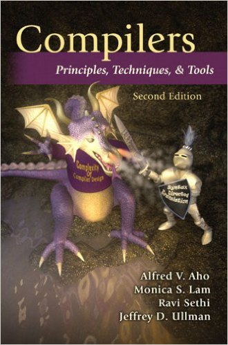

- [CS 1622](#cs-1622)
  * [Course Information](#course-information)
  * [Description](#description)
  * [Class Components](#class-components)
  * [Grading](#grading)
  * [Assignment submission](#assignment-submission)
  * [Programming Language Selection](#programming-language-selection)
  * [Participating in Class](#participating-in-class)
  * [In-Person Attendance](#in-person-attendance)
  * [Disability Services Statement](#disability-services-statement)
  * [Academic Integrity Statement](#academic-integrity-statement)

# CS 1622
Introduction to Compiler Design - Fall 2024

## Course Information

**Taught by:** Wonsun Ahn (wahn at pitt dot edu)
  * GitHub username: wonsunahn

**Class Time and Location:**

  * Tue/Thu 1:00 PM - 2:15 PM @ 404 IS Building

**Instructor's Office Hours:**

  * Chat on Microsoft Teams: Mon-Fri 9:00 AM - 6:00 PM
  * Physical Office Hours: Mon 4:30 - 6:00 PM @ 621 IS Building, Fri 2:00 PM - 3:30 PM @ 5423 Sennott Square, or by appointment

**Grading TA Information:**

  * Name: Raja Krishnaswamy (rek94 at pitt dot edu)
  * Primary mode of communication: "Regrade Request" on GradeScope
  * Secondary mode of communication: Chat on Microsoft Teams

**Class GitHub repo:** https://www.github.com/wonsunahn/CS1622_Fall2024

**Required Texts:**

Alfred V.Aho, Monica Lam, Ravi Sethi and Jeffery D.Ullman, Compilers: principles, techniques and tools, 2nd Edition, 2006, Addison-Wesley Publishing Company. 

## Description

This course takes you through the design and implementation of current
high-level languages. Both frontend and backend issues are dealt with. The
frontend is the part of a compiler that analyzes a program to produce a form
of internal representation (IR) that is more easily understood by the compiler.
The frontend comprises components such as: lexical analysis, syntax analysis,
and semantic analysis. The backend is the part of a compiler that takes the IR
and produces machine code that can be efficiently executed by the processor.
The backend comprises components such as: target code genera-tion, register
allocation, and code optimization. The course also touches upon the management
of storage locations such as processor registers, the program stack, the
program heap and the role of the compiler and language runtime.

## Class Components

**Exams**:  There will be two midterm exams (non-cumulative).  If you have a
medical or family emergency that prevents you from taking an exam, please
message me on Teams **before the exam** so that I can verify your emergency and
give you permission for a make-up.

**Projects**: The course project will take you through the implementation of a
compiler for a simple toy programming language called Mini-Java, starting from
the frontend and ending in the backend. The project is divided into 4 phases
(lexical analysis, syntax analysis, semantic analysis, and code generation),
and each phase requires a separate submission.  The latter phases are built on
top of the former phases so it is important that you do not fall behind.  If
you do fall behind, there is a 5% late submission penalty per day.  The
projects are written in the C programming language.  

**Homeworks**: There are two written homeworks that prepare you for the two
exams.

**Participation**:  TopHat attendance will be taken every day.  Also, there
will be TopHat questions asked during class to check that you have been paying
attention.  I will also be monitoring your contribution to in-class and
out-of-class discussions.

## Grading

* 4 Projects (40%): 10% each
* Exams (40%):
  * Midterm - 20%
  * Final - 20%
* 2 Homeworks (10%): 5% each
* Participation (10%)

The following grading scale will be used.  Note that I generally do _not_ round
grades up.

Score  | Grade
-----: | ------------------------------
100.00-93.00 | A (A+ for extraordinary work)
92.99-90.00  | A-
89.99-87.00  | B+
86.99-83.00  | B
82.99-80.00  | B-
79.99-77.00  | C+
76.99-73.00  | C
72.99-70.00  | C-
69.99-67.00  | D+
66.99-63.00  | D
62.99-60.00  | D-
59.99-0.00   | F

## Assignment submission

All written and programming submissions will be done through GradeScope.  You
are free to do as many submissions as you would like before the deadline.  You
are encouraged to do multiple submissions for programming assignments in
particular as the autograder will give you feedback on each submissions, upon
which you can improve.

Programming assignments will be done in a GitHub Classroom repository.  Please
commit and push frequently for code backup and versioning purposes, as a matter
of good software engineering pratice.  The repository can be submitted in its
entirety to GradeScope.  Make sure you commit and push your changes before
submitting.  

## Programming Language Selection

For all deliverables, the class will use C/C++ with the appropriate frameworks
(Lex/Yacc).  Projects written in other languages or using alternative
frameworks will not be accepted.

## Participating in Class

Questions and comments are invited and strongly encouraged.  If you have a view
point or experience that may enrich the class, please jump in!  There are
several ways you can participate:

1. In-class

    If you are in-person and you have a question, just interrupt me and
interject.  Raising your hand is optional.  

2. Offline

    Please use the Teams "Posts" tab on the "General" channel if you have a
general question or comment.  If you have a question about a specific topic for
which there is a dedicated channel, please use that channel.  For example,
there is currently a "Partner Exchange" channel besides the "General" channel,
so please use that channel to broadcast messages about partners.  Remember, you
are encouraged to answer as well as ask questions!  I will give a thumbs up on
verified answers or I will add a few more things if needed.  

    You can easily DM me or one of your classmates using Teams.  Again, select
the class in the "Teams" menu and then click on the "..." context menu beside
the "CS 1622 Compiler Design" team name.  Please select the top-most
item: "Manage Team".  There, you should be able to see the statuses of all
students in the class, and if you hover over the name of any student, you
should see options to initiate a chat, email, or a call with that individual.

3. Email / Canvas messages

    For the fastest response, please use Teams chat.

When you ask a source-code-specific question, please submit your code to
GradeScope first so that I can reproduce your error.  Also, describe precisely
the steps I should take to reproduce your error.  Before you do this, it is
very hard for me to help you.

I will try to get back to all offline communications within 24 hours of
receipt.  Even if I'm logged onto Teams, please understand that I may be away
from my desk or working on something else.  Meanwhile, feel free to answer each
other's questions!

## In-Person Attendance

This is fully in-person class.  I will allow remote participation only if you
have a family or medical emergency that would otherwise cause you to miss
class.  Rather than have you miss class, I will allow remote participation.

For the above exceptions, I will create Zoom sessions on demand.  These Zoom
sessions are only available to affected students and are protected by a
password which is distributed individually.  Please notify me as soon as you
are affected so that I can make arrangements.

## Disability Services Statement

"The Office of Disability Resources and Services (DRS) provides a broad range
of support services to assist students with disabilities. Services include, but
are not limited to, tape-recorded textbooks, sign language interpreters,
adaptive and transportation. Contact DRS at 412-648-7890 or 412-383-1355 (TTY)
in 216 William Pitt Union or see www.drs.pitt.edu for more computer technology,
Braille translation, and nonstandard exam arrangements, DRS can also assist
students with accessibility to campus housing information."

The instructor will work to the best of their ability to accommodate any issues
arising from a disability that a student has, but he must be aware of it in
order to accommodate it.  Please inform me as soon as possible if you have a
disability which you think may hinder your success in the course and we (along
with the DRS) should be able to work around it.

## Academic Integrity Statement

Cheating/plagiarism will _not_ be tolerated. Students suspected of violating
the [SCI Academic Integrity
Policy](https://www.sci.pitt.edu/student-resources/policies/academic-integrity-policy)
will receive a minimum sanction of a zero score for the exam or assignment.

Some guidelines:

1. For all submissions, viewing the work done by your classmates (or a 3rd
source) before submission is considered cheating.  Aiding this activity is also
considered cheating.

2. Text or code generated by generative AI such as ChatGPT or CoPilot is
included in the prohibited 3rd source mentioned above.  You should be the sole
originator of all text or code that you submit as part of this class.
